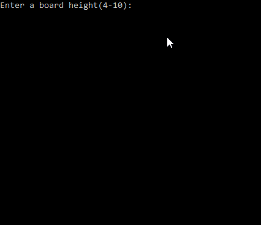

# A Connect 4 clone with some custom features.

## **Current features**:

1. user inputs height and width for the board
2. handles invalid user inputs
3. loop to replay the game with options to change or keep settings
4. each of the two player slots can be played by AI or user input
5. AI selection uses the minimax algorithm to pick a move

  

## **Possible future plans**:

1. win condition algorithm optimization
2. additional scoring for the minimax algorithm
3. graphic user interface

